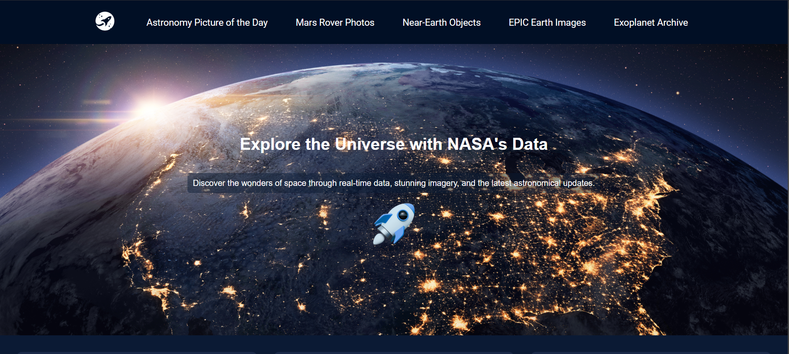

## 💡 Project Name: NASA Explorer V2
### 📌 Description:
A NASA photo explorer using NASA APIs

### 🧠 Skills Applied:
- HTML, CSS, JS, REST API, Async Data Handling
- Component-based architecture
- Responsive UI with Tailwind CSS

### 📸 Screenshots:

